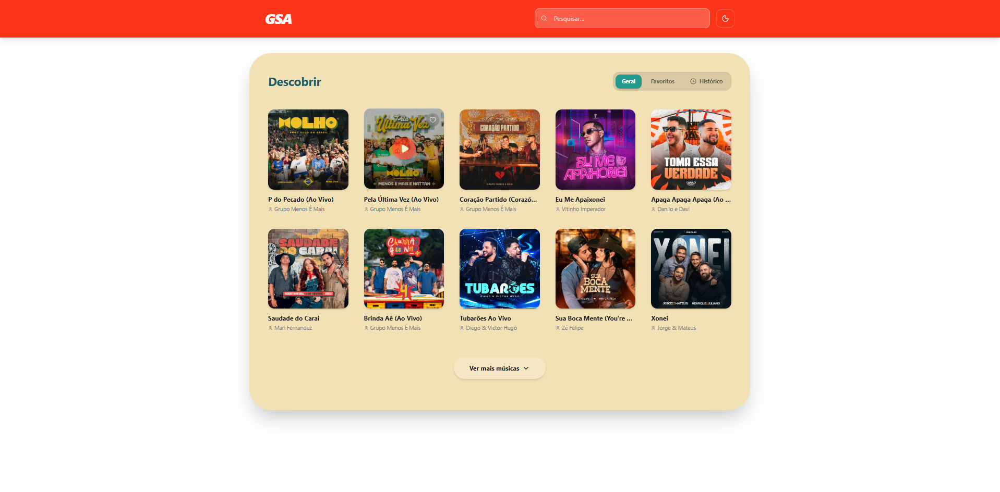

🎵 GSA Music Player
O GSA Music é um player de streaming de música moderno, construído com React, TypeScript e Tailwind CSS. O projeto consome a API da Deezer para fornecer descobertas musicais, buscas e prévias de áudio de alta qualidade com uma interface fluida e responsiva.

✨ Funcionalidades
Descoberta (Trending): Lista as músicas mais tocadas do momento.

Busca em Tempo Real: Pesquise por faixas, álbuns ou artistas.

Discografia do Artista: Clique em um artista para ver suas músicas mais populares.

Sistema de Favoritos: Salve suas faixas preferidas localmente (Zustand + Persist).

Histórico de Reprodução: Acompanhe as últimas músicas ouvidas.

Player Completo: Controle de reprodução (Play/Pause/Skip), barra de progresso interativa e controle de volume.

Modo Dark/Light: Interface adaptável ao tema do sistema ou preferência do usuário.

🚀 Tecnologias Utilizadas
React 18 (Vite)

TypeScript (Tipagem estrita para maior segurança)

Zustand (Gerenciamento de estado global leve e persistente)

Tailwind CSS (Estilização moderna e responsiva)

Lucide React (Pacote de ícones)

Deezer API (Via Proxy para estabilidade de rede)

🛠️ Como rodar o projeto
Clone o repositório:

Bash
git clone https://github.com/seu-usuario/gsa-music.git
Instale as dependências:

Bash
npm install
Inicie o servidor de desenvolvimento:

Bash
npm run dev
📈 Evolução Técnica
Este projeto começou utilizando a rede descentralizada Audius, mas evoluiu para a Deezer API para garantir 100% de disponibilidade de conteúdo (evitando erros 502/Timeout) e maior velocidade no carregamento de capas de álbuns e streams de áudio.